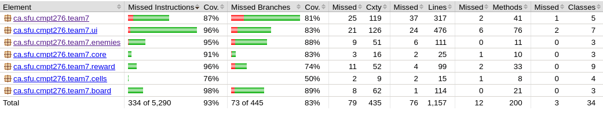

# CRAWL! - A Super Entertaining 2D Arcade Game 

## Game Description

The CRAWL! A Super Entertaining 2D Arcade Game is a simple grid‑based adventure where the player moves around the board, collects keys, opens chests, and avoids traps. Keys are required to progress, chests give bonus points, ogres and traps take points away, and goblins immediately end the game. The board is made of different cell types that control movement and interactions, and everything runs on a tick‑based loop that updates player actions and game events. Enjoy!!

---

## Gameplay Video 
[](https://www.youtube.com/watch?v=J9yxLJ40mUo)

---

## Controls

- Arrow Keys / WASD: Move player
- Space: Start game, continue from popups, resume from pause, and replay from end screen
- P: Pause game
- Collect keys to unlock exit
- Avoid enemies and traps
- Bonuses spawn at intervals, collect them for a higher score!

---

## Tech Stack / Libraries

- Language: Java
- Frameworks:
  - JUnit (testing)
  - Maven (build tool)
- Libraries (ONLY real external ones, not Java standard library)

---

## Project Structure

```
.
├── Artifacts
│   ├── apidocs
│   └── spring2026team7-1.0.jar
├── Design
│   ├── CMPT276_Group7TeamContract.pdf
│   ├── CMPT276_Group7_UML.pdf
│   ├── Phase 1 Game plan CMPT 276.pdf
│   └── uimockup.pdf
├── Documents
│   ├── Phase2Report.pdf
│   ├── Phase3Report.pdf
│   └── Phase4Report.pdf
├── README.md
├── mvn
├── pom.xml
└── src
    ├── main
    │   ├── java
    │   └── resources
    └── test
        ├── java
        └── resources
```

## How to Build

Explain how to compile the project using Maven:

```bash
mvn clean install
```

## How to Run 
To run the game, use Maven from the project root directory:
```bash
mvn clean compile exec:java
```

## How to Generate Artifacts
### JAR file
To generate the JAR file, run:
```bash
mvn package
```
Generated JAR file:
```target/spring2026team7-1.0.jar```

To run the generated JAR file, use:
```bash
java -jar target/spring2026team7-1.0.jar
```

### Javadocs
To generate the Javadocs, run:
```bash
mvn javadoc:javadoc
```
Generated Javadocs:
```target/reports/apidocs/index.html```

## How to Test
```
mvn test
```

## Test Coverage 
Tools used: jacoco
How to generate report:
```
mvn verify
```
Where to find it:
```target/site/jacoco/index.html```

Our overall coverage ended up being quite solid, with 93% instruction coverage and 83% branch coverage across the full project. These numbers show that our tests reached most of the meaningful gameplay paths, including UI behavior, enemy logic, board loading, and reward/trap interactions. Since unit test coverage in typical software projects often falls in the 70–90% range, our results sit comfortably within (and in some areas above) that expected window. Overall, the coverage suggests that the codebase is reasonably well tested and that the core mechanics behave consistently under different scenarios.



## Spring2026Team7

Members:  
MacKinnon, James,	jam48@sfu.ca  
Matsumoto, Yui,	yma99@sfu.ca  
Ng, Auston,	acn8@sfu.ca  
Pakravani, Rammy,	rpa89@sfu.ca  
Sandilands, Xavier,	njs12@sfu.ca  


